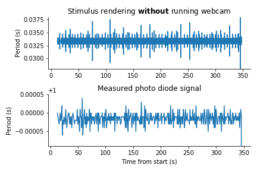

# Bonsai + Allen : A report on integrating Bonsai into our behavioral pipeline

---

## Highlights

* Bonsai was straightforward to connect to our existing rig hardware, including the stimulus monitor, lick spout, and reward delivery system.

* We did not see any evidence for dropped frames when displaying visual stimuli, except when Bonsai was pushed to the limit (hundreds of simultaneously displayed gratings).

* Programming novel tasks in Bonsai is a challenge—not because it lacks functionality, but because it takes a long time to become fluent in its conventions and syntax.

* If we are to adopt Bonsai as a replacement for Camstim, we will need to invest in improving the  documentation and examples related to our most common use cases, so the learning curve is not as steep. 

---

## Introduction 

### What is Bonsai?

[Bonsai](https://bonsai-rx.org) is an open-source visual programming language for controlling systems neuroscience experiments. The logic of each experiment is specified by a Bonsai “workflow” file, which defines how diverse input and output signals are coordinated in time. The [BonVision](https://bonvision.github.io/) package includes workflow nodes for generating visual stimuli and presenting them with high temporal fidelity. Additional packages provide interfaces to NI hardware, Arduinos, and other data acquisition devices. This makes it feasible to replicate the functionality of Camstim, the MindScope Program's PsychoPy-based behavioral control software, using existing Bonsai packages.

### Why switch to Bonsai?

There are several reasons why Bonsai may be an attractive alternative to Camstim:

* Bonsai is an open-source project with a relatively large user base. If external scientists want to replicate our stimuli or behavioral paradigms, it's easier to share a .bonsai file that specifies the task logic than to release and support a complex Python package. If our rigs are Bonsai-compatible, it also makes it easier for others to submit new tasks to be run on them (e.g., for OpenScope).

* Many experiments run with Camstim suffer from dropped frames, inconsistent frame intervals, or other stimulus-related irregularities. At least according to the published benchmarks, Bonsai could help us avoid these problems.

* The lack of standardized software for defining rodent behavioral tasks is a huge impediment to progress in neuroscience. Bonsai is the software that is best-positioned to become this standard, and this seems like something worth supporting.

### Goal of this effort

This document details ongoing efforts to assess whether Bonsai can replace Camstim for controlling both passive viewing and active behavior experiments as part of the Allen Brain Observatory pipeline. 

These efforts include: 

1. Identifying requirements for stimulus generation, related data collection (e.g., running speed), and outputs needed by downstream processing modules.

2. Producing test scripts that represent the range of needed functionality.

3. Quantifying the performance (e.g., temporal fidelity) of Bonsai. 

For successful integration into the pipeline, Bonsai would need to operate in conjunction with existing software packages, such as WSE, Sync, and Multi Video Recorder (MVR), as well as with existing services, such as BehaviorMon and mTrain. In closed-loop scenarios, Bonsai would also need to update stimuli in response to lick spout and running wheel input in real time. 

These efforts will also help us understand the flexibility (or limitations) of Bonsai to meet potential future needs as well as the requirements to maintain Bonsai as a part of our pipeline in the future.

### Bonsai design principles 

Behavioral task designs are specified as Bonsai workflow files (extension: .bonsai). These files will need to be provided by each internal or external scientific team. Hardware components of the pipeline will be integrated with existing Bonsai modules and (if necessary) with custom Bonsai packages written in C#. Commonly used stimulus types can be saved as reusable workflow elements that can be shared by multiple scientific teams; once a core set of stimulus types have been created, it is possible that new experiments (i.e. workflow files) can be created simply by combining existing workflow elements. Each package will have a deployed and testing mode, allowing individual packages to emulate normal functions on the experimental rig when the hardware is not available.

*Note:* It is possible to integrate Python code into Bonsai workflows, with some caveats. Bonsai currently ships with a Python operator, but this is based on IronPython, which is stuck on Python 2.7 and can't interface with essential CPython libraries such as numpy. This limitation could be circumvented by using a library such as [pythonnet](https://pythonnet.github.io/), but it would take some work to get this up and running.

### Areas for evaluation

#### Stimulus and task definition
We aimed to ensure that Bonsai can cover our desired range of use cases with a simple/limited set of test cases: 
  - Passively viewing visual stimuli 
    - Static and drifting gratings 
    - Natural images and movies 
    - Sparse Noise
    - Random Dot Kinematograms
  - Active behavior 
    - Run a simple go/no go task with only one natural image associated with go and no go trials, with fixed trial probabilities. 
    - Run a simple detection of change behavior with fixed change probability.  
  - Concatenating scripts  
    - Run an experiment built from multiple scripts, e.g.: 
        - Run static gratings stimuli.
        - Run a behavioral experiment.

#### Pipeline integration 
  - Bonsai should be compatible with our behavior hardware (lick spouts, running wheels, etc.) and our hardware control packages (such as `daqmx`)  
  - We should be able to make a portable hardware configuration using Bonsai. 
  - We should evaluate how hardware configuration parameters will be saved (port number and device address for instance).  
  - Scripts should be able to reference input/output components by an informative name (for instance, `lick_line_status` or `reward_signal`, rather than `NI device 1, input 0`).  
  - We need to start scripts from WSE/Mouse Director 
  - We need to be able to poll for status (15 or 20 things) 
  - We need Bonsai to publish stats along the way (to accumulator) 
  - We need outputs to be compatible with downstream processing modules
 
#### Benchmarking
  - Performance levels (in terms of temporal precision) should be compatible with behavior experiments, including visual stimulus presentation 
  - We should check that BonVision’s stimulus warping functions properly and that warping does not impair display performance beyond our QC criteria. 
 
## Methods

### Description of Bonsai test rig

For this effort, we built a testing rig at the Institute allowing scientific teams to submit integration tests of their Bonsai workflow with a reasonable duplicate of the pipeline hardware:
- This rig had a replicated Stimulus computer, Sync computer, Camera monitor computer with the same specifications as the pipeline rigs. 
- The stimulus computer running Bonsai had an Nvidia Quadro K4000 graphics card and 32 GB of RAM.  
- The 6321 DAQ is installed in the stimulus computer running Bonsai via PCIe connection. Digital output lines are configured using this DAQ to output signals from Bonsai workflows which are captured on a seperate machine via a PCIe-6612 DAQ to be analyzed. 
- Due to the DAQmx library not having a digital input function at the present time (see [Discussion](#Discussion)), digital inputs to the Bonsai stimulus are implemented via an Arduino Micro attached to the stimulus computer via USB. 
- Lick detection was implemented with a piezo contact microphone but could be bypassed with a signal generator which was used to provide a 0.1 Hz signal for testing
- Sync lines installed and used in this study are shown in the table below with labels

- As on all physiological rigs, a photodiode was installed in the top-right corner of the stimulus monitor and connected by a photodiode circuit connected to a dedicated sync line. 
- A subset of sync lines were turned on and off by various experimental workflows (see below). 

### Description of workflows

Based on requirements for multiple use cases, we designed and created multiple complementary workflows. Each workflow was led by a different scientist so multiple people would have the opportunity to learn Bonsai, and give feedback about the user experience. 

1 - **Passive viewing workflow**.
This workflow presented windowed drifting gratings of various contrasts as well as a replicated version of the locally sparse noise stimulus. 
All stimuli were wrapped onto a spherical projection as is currently being implemented in Camstim. 
This workflow is available [here](https://github.com/AllenInstitute/bonsai_workflows/tree/master/PassiveViewing).

2 - **Go/No Go behavior workflow**.
This workflow presented 2 natural images, one associated to a GO stimulus and the other to a NO GO stimulus. The GO stimulus triggered an external reward line.
The presentations were randomly selected from a uniform distribution at run-time. 
All stimuli were wrapped onto a spherical projection as is currently being implemented in Camstim. 
This workflow is available [here](https://github.com/AllenInstitute/bonsai_workflows/tree/master/Go-Nogo).

3 - **Detection of change workflow**.
This workflow presented 8 natural images, loosely following the logic of the visual behavior workflow. Image change was triggered by pulling from a uniform distribution that determined how many times each image was repeated. A pre-change lick would delay subsequent change by 2 presentations. This workflow was fully functional, displaying warped natural images full screen and dispensing water rewards with a set valve opening duration while touching the water spout upon the image change, though some additional development and testing will be required to ensure that the logic fully emulates the Camstim implementation of detection of change.
This workflow is available [here](https://github.com/AllenInstitute/bonsai_workflows/tree/master/DetectionOfChange).

4 -  **Performance measurement workflow developed by Goncalo Lopes**. Our intent here was to compare performance metrics of our test rig with published values. This workflow displayed an increasing large number of drifting gratings in an array pattern to assess performance of Bonsai and BonVision under stress. 
This workflow is available [here](https://github.com/AllenInstitute/bonsai_workflows/tree/master/GridGratingDrawing).

The following elements were shared by all workflows:

  - All workflows triggered the photodiode sync line via BonVision, similar to how Camstim creates an oscillating black and white square under the photodiode. 
  - All workflows flipped a dedicated sync line upon frame calculation.

In addition, the "Detection of Change" workflow leveraged digital lines to measure:
  - The turn-around time to read a lick TTL into an external TTL on another sync line. 
  - The reward calculation time to convert a lick TTL into a trigger reward via a TTL pulse when an image changed happened concurrently to a lick. 

### Description of tests

Using the above described platform and workflows, we ran a series of tests and quantifications. Those tests were meant to evaluate the stability and performance of our workflows. 
We ran each workflow separately. The associated datasets are available [here](https://github.com/AllenInstitute/bonsai_workflows/tree/master/Analysis). 

Briefly: 

- Test on Bonsai performance script: Workflow that display increasingly large number of gratings, ran and analyzed. 
  - https://github.com/AllenInstitute/bonsai_workflows/tree/master/Analysis/GridGratingDrawing

- Test on passively viewing stimuli: Workflow that display driftings gratings and locally sparse noise, ran and analyzed
  - https://github.com/AllenInstitute/bonsai_workflows/tree/master/Analysis/PassiveViewing_run1
  
- Test on Go/No:
  - https://github.com/AllenInstitute/bonsai_workflows/tree/master/Analysis/long_stim_test_1
  Ran for an hour long with no interactions. 
  - https://github.com/AllenInstitute/bonsai_workflows/tree/master/Analysis/keyboard_test_1
  Ran for approximately 5 min with manual keyboard interactions

- Tests on Detection of change
  - https://github.com/AllenInstitute/bonsai_workflows/tree/master/Analysis/det_change_short_manual
  Ran for approximately 5 min with manual keyboard interactions. All hardware was connected and functional (lick sensor, water valves)

  - https://github.com/AllenInstitute/bonsai_workflows/tree/master/Analysis/det_change_long_no_licks
  Ran for an hour with no incoming licks. All hardware was connected and functional

  - https://github.com/AllenInstitute/bonsai_workflows/tree/master/Analysis/det_change_long_fake_lick_generator
  Ran for an hour with a 0.1 Hz TTL generator as lick input incoming licks. All hardware was connected and functional. Reward valve was triggered

  - https://github.com/AllenInstitute/bonsai_workflows/tree/master/Analysis/detection_of_change_with_camera
  Ran for approximately 5 min with a workflow that performs detection of change while also acquiring and saving a camera feed at 30Hz

  - https://github.com/AllenInstitute/bonsai_workflows/tree/master/Analysis/detection_of_change_without_camera
  Same as above but camera feed was disabled. 

## Results

### Passive viewing experiments

#### Stress test

To validate our measure of performance and push Bonsai over its limit, we reproduced a performance quantification published in the BonVision paper [(Lopes et al. 2020)](https://www.biorxiv.org/content/10.1101/2020.03.09.983775v3). To that end, we [modified a workflow](https://github.com/AllenInstitute/bonsai_workflows/blob/master/GridGratingDrawing/gabor.bonsai) displaying an increasingly large number of non-overlapping grating elements. A reference figure was published in the original BonVision publication and is shared here for ease of comparision:

*Quantification of frame update period (Bottom) to display an array of drifting gratings (Top). Reproduced from (Lopes et al., 2020)*

In this test, Bonvision is tasked to display a very large number of drifting gratings in an array pattern. We replicated the code, utilizing our photodiode circuit to measure the rising time of requested stimuli updates. The associated analysis is [available in this notebook](https://github.com/AllenInstitute/bonsai_workflows/blob/master/Analysis/GridGratingDrawing/2021-05-12-GridGratingDrawing.ipynb). 

Our  figure below is faithful to the original published publication, i.e., approximately 1000 grating elements are necessary before performance (measured in frames per second [NOTE: Actually frames per second/2]) start to deteriorate:

*Quantification of frame update period to display an array of drifting gratings using the same workflow from (Lopes 2020) but on an Allen Institute stimulus test rig.* 

#### Stimulus update intervals

Having reproduced published measurements, we sought to evaluate Bonsai's performance with stimuli used in passively viewing experiments at the Allen Institute. We designed a workflow to display drifting gratings of various contrasts, as well as a duplicate of our Locally Sparse Noise stimulus (LSN). We measured the stability of the photodiode square pulse during this workflow via its corresponding sync line. 

.

*Quantification of photodiode stability during passively viewing of gratings and locally sparse noise*

The bottom part of the above plot shows this photodiode sync line. This signal was very stable, oscillating around the expected 1 s period with 5 to 10 microseconds of variation. This makes it clear that Bonsai had ample time to draw all of the graphical elements in the graphical card back-buffer. This worklow would only draw one grating and between 1 and 10 locally sparse noise blocks. This result is therefore expected given that we showed above that Bonsai starts to break when approximately 1000 objects are drawn. We expect those small fluctuations in photodiode times not to be due to Bonsai calculation times but rather result from the combined performance of the graphic card, the screen and the photodiode circuit. 

During each frame generation cycle, we also wrote 2 additional sync lines: 
  - One sync line every 2 frames as a proxy for stimulus rendering (top plot)
  - One sync line every time the photodiode square is asked to switch state (middle plot). 

Those line showed occasional spikes in duration from the average period. Both measures oscillated up to 2-3 ms from their mean. These spikes are likely resulting from occasional bursts in background processes running on the CPU during this passive recording session. They did not impact the final timing as eventually what matters is that Bonsai could keep up with the screen refresh rate. 

Indeed, none of these occasional spikes caused dropped frames, as shown on the corresponding photodiode signal. This result supports our previous stress test confirming that Bonsai is not operating close to its capacity with visual stimuli typically used. 

### Go/No task

The go/no tasks displayed a very similar set of performance characteristics as the passive viewing workflow. We first tested the tasks in non-interacting condition, i.e., by running it for an entire hour with the task logic activated, but without providing any simulated lick events. 

Similarly as for the passive viewing task, no dropped frames occurred and the photo-diode output signal was stable in a micro-seconds range. 

*Quantification of photodiode stability while running a go/no go task for an hour with no interactions*

We then tested whether interacting with the workflow would have any impact on performance. In this case, we used key-presses as a proxy for lick detection. 

*Quantification of photodiode stability while running a go/no go task with manual key-press interactions*

Timing remained unaffected in the presence of key-press events, supporting the conclusion that Bonsai had sufficient CPU bandwidth to process those actions. 

### Detection of change task

We dedicated the most effort to testing performance in the detection of change task. We replicated the previous analysis in 3 different conditions: 

1. Without any incoming licks.

*Quantification of photodiode stability while running a detection of change task for an hour with no interactions*

2. With licks coming from a TTL generator on a regular interval for the full duration of a typical session (approximately 1h).

*Quantification of photodiode stability while running a detection of change task for an hour with regular simulated licks at 0.1Hz*

3. With licks triggered manually by touching the actual lick spout by hand. 

*Quantification of photodiode stability while running a detection of change task for an hour with manual incoming licks*

We obtained a similar results as for all previous workflows, ie. no measured impacts on photodiode timings, despite occasional stimulus rendering fluctuations due to background processes. 

#### Delays associated with trial logic

A key component in the detection of change task (as well as in any active behavioral tasks) is the ability to quickly react to behavioral responses. For instance, inconsistent delays between a detected lick and a delivered reward would inject undesirable variability into our experiments. To quantify these delays, we leveraged available sync lines, as those provided the highest temporal resolution (100 kHz). Bonsai operators make it easy to trigger sync line changes at different moments of the task. 

1. We first immediately converted an incoming detected lick to a separate sync line. This allowed us to measure the *turn-around time* or the time required for Bonsai to (1) read a TTL line, (2) store the value and (3) write this state to an output line via the DAQmx libraries. 
This turn-around time recorded during a whole one-hour session is plotted below. 

.

*Quantification of lick turn-around time during a hour-long session with lick generator with a TTL pulse generator at regular intervals*

From this analysis and measurement, we concluded that Bonsai, in real working conditions, takes between 0.4 and 1.5 ms to read and write a digital line. 

2. The workflow used its internal logic to convert a lick to a reward and we simultaneously switched an additional sync line. In combination with the previous line, this allowed us to calculate an estimate for the *reward-calculation time* or the time to convert an incoming lick into a reward, exclusing all delays due to reading and writing through the DAQmx libraries. 

This calculation time recorded during a whole one-hour session is plotted below. 

.

*Quantification of lick calcuation time during a hour-long session with lick generator with a TTL pulse generator at regular intervals. Top panel is the time from an incoming lick to an outcoming reward. Bottom panel is the estimated reward calculation delay by substracting the corresponding lick turn-around time*

From this analysis and measurement, we concluded that Bonsai, in real working conditions, takes between 0.8 and 1.7 ms to convert a lick into a reward. 0.3 ms of this time is due to convert a lick to a reward while the rest is due to communication delays with the hardware. 

In addition we found that this delay was stable throughout the session as shown in the curve below. 

.

*Lick to water time during a hour-long session with lick generator with a TTL pulse generator at regular intervals.*

Overall a delay between 1 and 2 ms to trigger a reward, well below the response time of many fast computer screens (5-30ms), is compatible with Neuroscience experiments (Note: Does anyone know a good reference for temporal delay perception in rodents?)

### Concurrent acquisition of video

A key promise of Bonsai is its ability to quickly integrate multiple data modalities in a single data workflow. For example, measuring key behavioral parameters from a continuous stream of frames from a behavior camera would allow closed-loop experiments. While we do not anticipate this immediate use-case for the OpenScope project, this is a key property of Bonsai as [DeepLabCut modules](https://github.com/bonsai-rx/deeplabcut) have been fully integrated into Bonsai. To evaluate this capability, we measured the impact of continuously acquiring and saving frames from a webcam while running the detection of change task. The workflow for this experiment is [available here](https://github.com/AllenInstitute/bonsai_workflows/blob/master/DetectionOfChange/DetectionOfChange_with_hardware_and_camera.bonsai).  

The results for this comparison are plotted below. The associated code is [available here](https://github.com/AllenInstitute/bonsai_workflows/blob/master/DetectionOfChange/DetectionOfChange_with_hardware_and_camera.bonsai). 

.

*Quantification of frame update period in detection of change while acquiring and saving a video from a webcam at 30 Hz.* 

.

*Quantification of frame update period in detection of change without acquiring and saving a video.* 

The recorded video can be visualized [here](https://github.com/AllenInstitute/bonsai_workflows/blob/master/Analysis/detection_of_change_with_camera/camera_data.avi).

### Concatenating stimuli / tasks

To test this capability, we used the detection of change and passively viewing workflows. Bonsai has the ability to delay the "subscription" to a functioning block. In addition, the passively viewing workflow was structured with sub-script modules associated with drifting gratings and locally sparse noise stimuli. This allowed us to sequentially display first the detection of change tasks followed by a series of gratings. The only thing required was to delay the start of the gratings by using the correct delay time, as shown on the image below. 

*Example delaying of a stimulus block to add dritfing gratings to detection of change.* 

The associated concatenated workflow is [available here](https://github.com/AllenInstitute/bonsai_workflows/blob/master/ConcatenationWorkflow/DetectionOfChange_and_passive.bonsai).  

### Summary metrics across all workflows (all units in seconds)

Note that the **rendering period is half of the refresh period** as we measured the period using the rising edge of a TTL with a 50% duty cycle. The dropped frames are counted when the period between 2 consecutive photodiode pulses increases by more than 2 refresh period (0.033 ms). 

Code to generate this table is [available here](../Analysis/2021-05-26-across_condition_tables.ipynb).

|                                     |   Bonsai rendering period mean |   Bonsai rendering std |   Photodiode driving period mean |   Photodiode driving period std |   Photodiode actual period mean |   Photodiode actual period std |   Photodiode dropped frames |
|:------------------------------------|-------------------------------:|-----------------------:|---------------------------------:|--------------------------------:|--------------------------------:|-------------------------------:|----------------------------:|
| det_change_long_no_licks            |                      0.0333329 |            0.000253716 |                         0.999986 |                     0.000158512 |                        0.999986 |                    1.67488e-05 |                           0 |
| det_change_with_camera              |                      0.0333386 |            0.000942805 |                         0.999984 |                     6.55527e-05 |                        0.999984 |                    1.68234e-05 |                           0 |
| det_change_short_manual             |                      0.0333359 |            0.00040231  |                         0.999984 |                     0.000271031 |                        0.999984 |                    1.55728e-05 |                           0 |
| go_no_go_keyboard_test_1            |                      0.0333467 |            0.00149996  |                         0.999985 |                     0.000189803 |                        0.999985 |                    1.56983e-05 |                           0 |
| det_change_without_camera           |                      0.0333362 |            0.000510709 |                         0.999984 |                     6.0889e-05  |                        0.999985 |                    1.55199e-05 |                           0 |
| det_change_long_fake_lick_generator |                      0.033333  |            0.000229474 |                         0.999986 |                     0.000187263 |                        0.999986 |                    1.74524e-05 |                           0 |
| passive_viewing_long                |                      0.0333349 |            0.000478835 |                         0.999986 |                     8.85987e-05 |                        0.999986 |                    1.66179e-05 |                           0 |
| go_no_go_long_stim_test_1           |                      0.033333  |            0.00028457  |                         0.999986 |                     0.000137444 |                        0.999986 |                    1.60981e-05 |                           0 |

## Discussion

### Hardware integration

Hardware integration is one area where Bonsai clearly shines. With existing support for NI devices, Arduinos, and a wide range of cameras, it should be able to cover all of our hardware interfacing needs. It's also helpful that events from standard input devices (e.g., keyboard and computer mouse) can serve as a stand-in for digital input lines.

One limitation we encountered was that there is currently no "digital input" node for NI devices. The workaround was to use an Arduino for digital input.

It is straightforward to update the monitor configuration for a given rig by copy-pasting the relevant BonVision nodes into the workflow. These contain information about the monitor size, warping, and gamma calibration.

### Using Bonsai for coding behavioral experiments

It is clear that there is a steep learning curve to becoming proficient in Bonsai. There are many concepts from procedural programming languages that cannot be translated directly into Bonsai, which is closer to a functional programming language (see [this page](Bonsai_for_Python_Programmers.md) for an overview of key differences between Bonsai and Python). The behavior of particular Combinators (which are an essential for using Bonsai well) can be difficult to understand, and lack thorough documentation. While Bonsai makes it simple to do certain things that would be complicated in Python (e.g., coordinating responses to multiple asynchronous data streams), there are many things that are more complicated in Bonsai. This is bound to lead to frustrations for scientists that don't want to learn a new programming language to set up their experiment.

After carrying out our pilot experiments, a few things are clear:

- **There is almost nothing that can't be done in Bonsai.** Bonsai is a fully featured programming language, so it can be set up to produce any desired behavior. However, this can require the inputs of Bonsai experts (e.g., Gonçalo), in particular given the current state of the documentation.

- **Some implementations are better than others.** As an example of this, the GO/NOGO task we implemented was taking longer to display frames whenever the image changed. After Gonçalo inspected it, he found that the use of the `TimedGate` combinator was causing these delays; replacing it with an equivalent set of operators improved performance dramatically. For a naive user, there would be no obvious difference between these implementations.

- **Working examples are extremely important.** It's a lot easier to modify an existing Bonsai workflow than to build one from scratch. The available "prototype" workflows are currently lacking, so it would be extremely beneficial to develop more annotated examples. Similarly, a standardized pre-built workflow with all our hardware components included would greatly facilitate the development of new tasks.  

- **Debugging is easier in some ways, and harder in others.** One amazing feature of Bonsai is its ability to do introspection on the state of any operator while the workflow is running. However, when opening visualizers for many nodes in parallel, it can be difficult to keep track of all of them (i.e., having a centralized debug console would be helpful).

There are three ways that task development in Bonsai can be improved:

1. **Establishing local expertise.** It is not sustainable to rely on Gonçalo for troubleshooting (even though he is always more than happy to help). We need at least one in-house Bonsai expert who can help develop workflows and train others.

2. **Improving documentation and tutorials.** If we decide to adopt Bonsai, the developer time that would have been spent implementing a novel behavioral control system should be spent documenting Bonsai. It's worth mentioning that Bonsai's documentation is already superior to most open-source projects (including Camstim), but there are still many ways it can be enhanced. This will have tremendous benefits for both our own work, and for the wider community. The importance of this cannot be overemphasized -- the return-on-investment for this effort would be huge.

3. **Creating re-usable workflow elements and an empty canvas workflow with all pre-requisites.** If developing tasks in Bonsai can be as simple as copying and pasting standard building blocks, then it becomes much more practical for anyone to get up and running. This is aided by the fact that Bonsai workflows are defined by XML strings, which can be copied from anywhere (see [this page](https://open-ephys.github.io/onix-docs/Software%20Guide/Bonsai.ONIX%20Reference/index.html) for an example). An empty canvas workflow would provide key elements like rig geometry, photodiode square stimuli, warping, screen calibration, and basic sync lines already pre-configured. During our tests, we already converged to a shared basic structure between all workflows.

### Overall performance

By all measures, Bonsai performed extremely well for displaying visual stimuli. Stimulus rendering intervals were consistently within 2 ms of the median, and measured photodiode flips occurred within 50 microseconds of the expected interval. There was no evidence of dropped frames, except when the rendering loop was pushed to the limit, e.g. with hundreds of simultaneous drifting gratings. Performance did not deteriorate when camera frames were acquired and saved in parallel (although no online video processing was attempted).

It's safe to say that Bonsai's performance is better than Camstim, which often shows dropped frames and irregular stimulus intervals.
  
### Discussion on Bonsai programming concepts.

Bonsai is a "visual reactive programming language" which, at its core, is a wrapper around the [ReactiveX](http://reactivex.io/) library with interfaces to many common I/O devices used for behavioral neuroscience experiments. ReactiveX is based on concepts from *functional programming*, which may be unfamiliar to those of us who spend the vast majority of our time writing *procedural* code in languages such as Python. In particular, Labview and Python programmers could be misled to under-appreciate the importance of laying the foundation of these concepts prior to jumping into coding. This can make it difficult to follow the logic behind more complex Bonsai workflows, and can be a major impediment to constructing novel workflows. 

When first learning Bonsai, it is natural to try to translate concepts from procedural languages into our workflows. Indeed, there are many cases where this is neither possible nor desirable. Bonsai (and functional languages in general), surrender certain abilities in order to make it possible to write more performant, maintainable code. [We wrote a guide to highlight those differences](https://github.com/AllenInstitute/bonsai_workflows/blob/master/Documentation/Bonsai_for_Python_Programmers.md). 

Further documentation of Bonsai key aspects would be instrumental and is likely going to be necessary in the coming years. 

### Components to develop and integrate

Based on our experience, the following list contain the component that will need to be developed for Bonsai Integration in the pipeline.  
  - External interfacing
    - Messaging to and from Bonsai to enable interaction with BehaviorMon, WSE and MouseDirector.
  - Additional Hardware Interfaces
    - Implement DAQ digital input
    - Enhanced encoder
  - Determine output file formats
    - Bonsai must produce an experimental record (similar to the current pkl file) 

### Data format

If we adopt Bonsai, it is critical that its data outputs can interface with our existing analysis pipelines. At the same time, there are a lot of drawbacks to our current system (saving all behavior data + metadata in a pickle file), and switching to Bonsai presents an opportunity to rethink our approach.

In Bonsai, it is incredibly easy to do two things: 

1. Trigger a digital output on a software event and sending that event to a dedicated sync line.

2. Write timestamped data to a CSV file

This suggests a different way forward, in which any events relevant to the task or stimulus are associated with both a digital on/off transition recorded by the sync computer, as well as metadata stored in a CSV file. At the end of the experiment, it is simple to package all of this into a single file (pickle or otherwise), assuming a minimal amount of bookkeeping to keep track of which sync lines are associated with which type of events.

This approach is more "lightweight" and language-agnostic than what is used by Camstim, although it will take some work to define consistent conventions that can be used across experiments.
This proposal is practical as our pipeline sync hardware and wiring boxes have 6 available sync lines with another 10 (for a total of 16) that could be made available with changes to the sync box.  This concept was tested during the piloting efforts (utilized several of the available sync lines to turn on in software via Bonsai).

Storing behavioral critical information as sync lines comes with several benefits: 
  - The sync system is fundamentally our reference temporal system and has the highest temporal precision and reliability. 
  - Sync files are efficient and lightweight: They only store state transitions in an hdf5 file, thereby minimizing data storage required. 
  - We already are experienced handling and using those files throughout the whole data collection and analysis pipeline. 
  - NWB files stores stimulus information in a stimulus **trial** table which uses the same storage scheme: Individual events have a name, a start and end timestamps associated to it. The start and end timestamps are essentially the rising and falling edges of a sync line. 
See here for more details : https://pynwb.readthedocs.io/en/stable/tutorials/general/file.html#trials
  - This simple storage scheme provides a great deal of flexibility on how behavioral events are recorded. Each scientific team can leverage available sync lines within Bonsai in a way that fits their scientific requirements. 

  
### Workflow templates

To faciliate the development of new behavioral workflow, we propose to first develop an **empty workflow template** which will contain the connected nodes associated with :

1. Declaring the visual stimulation hardware
2. Creating the geometry associated with our rigs. 
3. Drawing and controlling the photodiode square pulse in the right position
4. Reading a lick line and sending it directly to the water reward line
5. Controlling one sync line for the start and end of the sessions and one sync line for following the stimulus rendering. 
6. Starting and aborting a workflow remotely
7. Saving the wheel speed.

Based on our experience with Bonsai, we assembled a first draft of this workflow, as shown in the figure below. This example highlights how easy and accessible are all of the components of the template.

*A proposed workflow template to develop new workflows. The modularity of Bonsai allowing to easily add new components is very apparent here. Each connected directed graph is associated with a description of its role*

Once this template is finalized, we recommend building exemplar sub-workflows that display drifting gratings, natural images and movies, and running the detection of change task. The modularity of Bonsai will allow us to copy/paste those worflows into the template while developing a new task. 

### Proposed strategy 

Migrating Bonsai to be used in the Allen Brain Observatory pipelines will be a multi-component process that should be tackled in distinct phases. This will allow us to avoid accelerated integration timelines and an efficient development. Importantly, our system should be backward compatible: Hardware and software should be functional with both camstim and bonsai-based system.

#### **Phase 0 :** Bonsai pilot + Report + Build plan
The purpose and content of this report.

#### **Phase 1 :** Single rig integration
  - Work out the need of running Bonsai during one session. 
  - Saving data.
  - Add the ability to start a Bonsai stimulus session from the WSE
  - Add messaging from Bonsai so it can return status to the WSE
    - Ready, displaying stimulus, stimulus completed (with completion codes)
  - Add capability to Bonsai so it can push stimulus status messages to the BehaviorMon service
    - Session started, encoder count, rewards issued, passes, fails etc.  
  - Generate template workflows for a variety of stimuli.
  - System to manage binary dependencies of stimuli.
  - Interaction with BehaviorMon.
  - Finalize faithful replicate of the detection of change task with a bonsai workflow (trial logic, abort logic,...)

#### **Phase 2 :** Cluster integration
  - mTrain integration.
    - WSE interacts with mTrain to determine which stimulus should be delivered to each mouse.  Bonsai ‘integration’ with mTrain is required only if automatic determination of script advancement is needed.  In this instance mTrain (or a replacement) must be updated to read and interpret the experiment record produced by Bonsai (Bonsai would not directly interact with mTrain).
  - WaterLog test and integration.
    - No integration required for WaterLog.  Water delivery should be implemented through a Bonsai plugin that interacts with the hardware (this will happen in phase 1)

#### **Phase 3 :** Testing integration
  - Testing at scale with mice trained through the pipeline with a previously validated and known behavior. 
  - Catch and fix integration issues

### Timeline

COLIN/QUINN : What is practical for each phase? Maybe propose different scenarii depending on resources and priority? 
- Answer from Colin:  I think we should be able to go faster than the timeline you proposed earlier (which seemed really long).  We could start of the phase 1 efforts in Q3 if desired.  That's where most of the work would be for us, I think.

#### **Phase 1 :** Single rig integration
  - Proposed timeline

#### **Phase 2 :** Cluster integration
  - Proposed timeline

#### **Phase 3 :** Testing integration
  - Proposed timeline
  
### Community engagement and ecosystem support

Bonsai already has a broad user base and a fair number of extensions written by the community. It is critical that we don't operate in a vacuum, and that we engage with existing users at every step of the way. Once our development plan is more concrete, we should share it with the community (e.g., through the [bonsai-users](https://groups.google.com/g/bonsai-users) forum), to make sure we are not doing anything that's redundant with others.

### Potential synergies with AIx2, IBL, SWC

In addition to the many individual labs that use Bonsai, there are several larger research groups that have already adopted it or are considering adoption. The International Brain Laboratory uses Bonsai to control its behavioral tasks, and they have been extremely helpful in pointing out the issues they've encountered. The Sainsbury Wellcome Centre at UCL is now working with NeuroGEARS (Gonçalo's company) to develop task infrastructure around Bonsai. And AIx2, launching in 2022, is planning to use Bonsai for behavior control. We should do our best to communicate with these other projects, and hopefully divide up the work required to document and extend Bonsai. Eventually, it may be worthwhile to orchestrate a collaborative grant (or some consortium-style funding agreement) to help sustain Bonsai over the long run.

## Conclusion

see [Highlights](#Highlights) at the top of the document.

## References

1.	Lopes, G. et al. (2015) Bonsai: an event-based framework for processing and controlling data streams. *Front Neuroinform* **9**: 7. 
2.	Lopes, G. et al. (2020) BonVision – an open-source software to create and control visual environments. *bioRxiv.* doi:10.1101/2020.03.09.983775. 

## Useful resources:
- Cajal courses: 
https://neurogears.org/vrp-2021/
- BonVision live coding Session: 
https://www.youtube.com/watch?v=3qyHzXBx0dE
- Bonsai workflow descriptions on confluence : 
http://confluence.corp.alleninstitute.org/display/CP/Bonsai+Demos
- Collection of Bonsai repositories (37 repos on January 25th 2021).  
https://github.com/bonsai-rx 
- Primary documentation site
https://bonsai-rx.org/docs
- BonVision documentation
https://bonvision.github.io/
- International Brain Laboratory (IBL) hardware lines interface with Bonsai repository 
https://github.com/harp-tech/IBL_behavior_control 
- Benchmark repository used in Bonvision preprint 
https://github.com/bonvision/benchmarks 
- Bonsai workshop with lots of introductory material for visual tasks 
https://neurogears.org/vrp-2021/ 
- Bonsai google forum
https://groups.google.com/d/forum/bonsai-users

