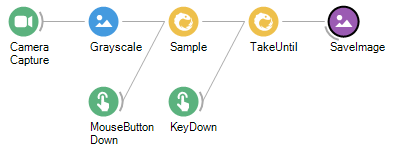

# Bonsai: A Guide for Python Programmers

Bonsai is a "visual reactive programming language," which, at its core, is a wrapper around the [ReactiveX](http://reactivex.io/) library with interfaces to many common I/O devices used for behavioral neuroscience experiments. ReactiveX is based on concepts from *functional programming*, which may be unfamiliar to those of us who spend the vast majority of our time writing *procedural* code in languages such as Python. This can make it difficult to follow the logic behind more complex Bonsai workflows, and can be a major impediment to constructing novel workflows. 

When first learning Bonsai, it is natural to try to translate concepts from procedural languages into our workflows. As we will see, there are many cases where this is neither possible nor desirable. Bonsai (and functional languages in general), surrender certain abilities in order to make it possible to write more performant, maintainable code. This guide is intended to explain the rationale behind some of these design decisions, in order to make working in Bonsai more intuitive and enjoyable.

<br/>

## Procedural versus functional programming

Procedural and functional programming represent two complementary approaches to designing software. In its ideal form, procedural programming is:

* Synchronous
* Linear
* State-dependent

A purely functional program, on the other hand, will be:

* Asynchronous
* Non-linear
* Stateless

Procedural programming is based on what we typically think of as *algorithms*: an explicit series of steps, executed in a particular order, that specify how a computer should behave. Functional programming, as its name implies, is based on *functions*: expressions that define how a particular input should be transformed into an output. A functional program (in principle) consists of a series of expressions that always operate on their input values in the same, predictable way. Expressions should have no *side effects*, which change their internal state in some way that cannot be observed by the rest of the program.

With procedural programming, there are no restrictions on functions having their own private states that can change with time. This is actually quite intuitive, because it's consistent with our concept of how the world works: our interactions with a real-world object are strongly dependent on that thing's internal state. However, this approach can make code harder to debug, because the output of a function cannot be predicted from its inputs alone.

Things become especially tricky when writing programs to handle many inputs and outputs in parallel. This is exactly the situation that arises in neuroscience experiments where stimuli and rewards are contingent on some behavioral readout. In this case, trying to keep track of state changes across multiple I/O sources can quickly lead to messy and uninterpretable code withot a lot of careful forethought. This is exactly the type of problem that Bonsai was designed to address.

<br/>

## `for` loops, and why they don't exist in Bonsai

Let's consider a simple Bonsai workflow that takes a series of camera frames and converts them to grayscale:


This workflow contains one "Source" (green) and one "Transform" (blue), and has no branch points. It's quite easy to imagine how we would translate this into Python:

```python
from camera_library import CameraCapture
from vision_library import Grayscale, WriteFrame

camera = CameraCapture(CAMERA_ID)

grayscale_frames = []

for i in range(MAX_FRAMES):

    frame = camera.getNextFrame()
    grayscale_frames.append(Grayscale(frame))
```
After the `for` loop runs, we end up with a list of frames, which we can analyze, visualize, write to disk, etc:

```python
>> type(grayscale_frames)
<class 'list'>
```

The important thing to note here is that the `for` loop is driving the processing. The actions happen sequentially inside this loop, always in the same order.

How else could we implement this functionality? Python has a neat feature called "list comprehension" which allows us to express the same actions more succinctly:

```python
grayscale_frames = [Grayscale(frame) for frame in camera.getFrames()]
```

Although the syntax is similar, there are some subtle differences worth nothing. For one, it's implicit in this formulation that, at some point, `getFrames()` will stop returning frames. When the output of `getFrames()` terminates, the processing by the `Grayscale` function will terminate as well. Although we've ceded some control to the `camera` object, the output is a list that's the same as when we used the explicit `for` loop:

```python
>> type(grayscale_frames)
<class 'list'>
```

There is yet another way that we can express the same actions: by using the `map` function. `map` is a built-in *higher-order function* that takes another function as input. This will allow us to do some functional programming within Python, by passing the `Grayscale` function into `map`:

```python
grayscale_frames = map(Grayscale, camera.getFrames())
```
This should give us the same overall result as the previous two formulations. However, the output is no longer a list, but an instance of the `map` class:

```python
>> type(grayscale_frames)
<class 'map'>
```
What we have done is *mapped* the `Grayscale` function to the output of `camera.getFrames()`, such that the result is not calculated until a frame becomes available. In this way, we can achieve the same outcome as when we used a `for` loop, but without needing to explicitly specify how many frames to process. Whenever a frame comes in, the `map` function ensures that it gets converted to grayscale.

Similarly, we could map the `WriteFrame` function to our `grayscale_frames` object, so the converted frames get written to disk as they arrive.

This last formulation is most similar to how operators work in Bonsai. There are no `for` loops in Bonsai because every operator is essentially its own *reactive* loop, either generating output sequences or creating transformed versions of its inputs. It is implicit that each operator will apply its internal function to every one of its inputs, until it receives a signal to terminate. In this way, Bonsai lets the incoming data drive the processing, without the need for the programmer to explicit determine the sequence of events.

<br/>

## Flow control: `if` statements and Conditions

For the next example, we'll start with some Python code:

```python
import numpy as np
from custom_library import functionA, functionB

normal_distribution = np.random.randn(10)

for value in normal_distribution:

    if 0 < value < 1:
        functionA()
    elif -1 < value < 0:
        functionB()
```
This is a very simple program that uses the value of a random number generator to determine which of two functions is called.

In Bonsai, we would set this up in a different, but equally approachable, way:


We start with a custom *GroupWorkflow* called "Normal Random" that generates normally distributed random numbers. This sends its output to two parallel *Condition* operators, called "GreaterThanZero" and "LessThanZero." At the names imply, the first one checks whether the value it receives is between 0 and 1, and the second one checks whether the value is between -1 and 0. If the appropriate conditions are met, the workflow will trigger sequences inside one of two *SelectMany* operators, called "SequenceA" and "SequenceB," similar to `functionA` and `functionB` in the Python example.

Logically, this program replicates what we wrote in Python, but with one important difference. The *Condition* operators in Bonsai are **non-blocking**, which means both branches of the workflow can be active simultaneously. If two values arrive in quick succession, the first one greater than 0 and the second one less than 0, "SequenceB" can be initiated before "SequenceA" has even finished. This contrasts with our Python implementation, where the next value cannot be checked until `functionA` or `functionB` returns.

There are of course ways to allow functions to run concurrently in Python, most notably the `asyncio` library. However, these are not typically used in everyday coding. As a result, Python programs are inherently *linear*, while Bonsai workflows are inherently *parallel*.

Before we explore the implications of this fact in more detail, let's take a look at what's inside the "GreaterThanZero" operator:


This is quite a bit less succinct than the `0 < value < 1` we used to perform the operation in Python, but it has the same functionality. The incoming value is sent to two comparison expressions, one that checks if it's greater than 0, and one that checks if it's less than 1. The outputs of these are combined using the *Zip* operator, followed by the *LogicalAnd* operator that outputs `True` if both of these conditions are met. Importantly, the output of the complete *Condition* operator is not `True`, but is instead the value that was passed into it. It acts as a gate for passing information, which is a bit different than what we're used to Python. 

In practice, we can use *Condition* operators to check for any relevant state changes. For example, we could set up a *Condition* to determine whether or not a response occurred in a reward window, whether a subject entered a certain part of the environment, or whether a neuron's firing rate went above a threshold. Unlike with an `if` statement, *Condition* operators will not block any other part of the workflow, including other *Conditions* that are being checked in parallel. So while adopting Bonsai may mean we have have given up the familiar `if` ... `else` syntax, in return we have gained a powerful new tool.

<br/>

## Coordinating data I/O

Let's return to our camera capture example. Now, instead of streaming a video to a file, we're going to save an image every time the mouse is clicked. We also have an operator that's checking for keyboard inputs, and stops the workflow if the spacebar is pressed. 



It should be easy to interpret what's happening here, as the flow of data is intuitively represented by the left-to-right organization of the operators.

There are nearly limitless strategies to translate this into Python. Here, we'll use a design pattern that relies on "callbacks" that run whenever a new input event arrives. The program constantly checks the various input streams for incoming events, and then runs a specified function that responds to them. Global variables are used to keep track of states:

```python

from camera_library import CameraCapture
from vision_library import Grayscale, SaveImage
from io_library import Mouse, Keyboard

camera = CameraCapture(CAMERA_ID)
mouse = Mouse()
keyboard = Keyboard()
output_directory = '/path/to/output'

saveNextFrame = False
acquire = True

def camera_callback(frame):

    global saveNextFrame

    if saveNextFrame:
        SaveImage(Grayscale(frame), output_directory)
        saveNextFrame = False

def mouse_callback(event):

    global saveNextFrame

    if event.mouseDown == True:
        saveNextFrame = True

def keyboard_callback(event):

    global acquire

    if event.key == 'space':
        acquire = False
        
def check_inputs():

    if mouse.event():
        mouse_callback(mouse.getEvent())

    if keyboard.event():
        keyboard_callback(keyboard.getEvent())

    if camera.frameAvailable():
        camera_callback(camera.getNextFrame())

while acquire:

    check_inputs()

```

Note that the function to check whether or not the key was pressed happens in the same loop as the camera capture. This is an example of synchronous programming, because each function call blocks the next one.

It's also important note that some of these Python callbacks have "side effects," such as changing the state of global variables, while others depend on the state of these variables. In Bonsai, side effects can only happen inside "Sink" operators, which pass their inputs out of the other end unchanged.

Another big difference is that for a user to determine the relationships between the various inputs and outputs requires reading the code in detail, whereas with Bonsai it was much easier to parse how data was being transformed just by looking at the workflow. In general, Bonsai (and functional languages in general) have a more elegant way of representing data *flows.* In Python, we are stuck using an explicit sequence to coordinate operations that we would naturally think of occurring in parallel (such as camera capture, key presses, and mouse clicks).

As stated previously, it's entirely possible to carry out arbitrarily complex asynchronous, parallel operations using Python. But parallelism is not an inherent part of the language, as it is with Bonsai. It's also true that true that Bonsai has plenty of its own complex (likely procedural) code under the hood for coordinating I/O operations. However, this can be ignored by the average user. 

<br/>

## Conclusion

This guide has provided the rationale for why some common concepts from procedural programming cannot be translated into Bonsai. Using Bonsai effectively requires abandoning the procedural mindset, which can be  difficult for those of us who use Python or other procedural languages on a daily basis. While it's certainly the case that some operations that would be simple in Python are frustratingly complex to implement in Bonsai, the opposite is also true. Bonsai makes it straightforward to program causal relationships between sequences that are evolving in parallel. It does this via:

- *Operators* that transform their inputs automatically, without the need for `for` loops
- *Conditions* that can run in parallel, without blocking subsequent inputs
- *Combinators* that determine how sequences interact with one another

The last topic will likely be covered in a future iteration of this guide, since it's central to the way that Bonsai works. For now, you can read up on Combinators in the [Bonsai documentation](https://bonsai-rx.org/docs/operators/#combining).
