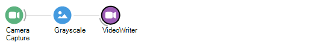

# Bonsai: A Guide for Python Programmers

Bonsai is a "visual reactive programming language," which, at its core, is a wrapper around the [ReactiveX](http://reactivex.io/) library with interfaces to many common I/O devices used for neuroscience experiments. ReactiveX is based on concepts from *functional programming*, which may be unfamiliar to those of us who spend the vast majority of our time writing *procedural* code in languages such as Python. This can make it difficult to follow the logic behind more complex Bonsai workflows, and can be a major impediment to constructing novel workflows. 

When first learning Bonsai, it is natural to try to translate concepts from procedural languages into our workflows. As we will see, there are many cases where this is neither possible nor desirable. Bonsai (and functional languages in general), surrender certain abilities in order to make it possible to write more performant, maintainable code. [one other sentence]

## Procedural versus functional programming

In their ideal form

Procedural programming is:

* Synchronous
* Linear
* State-dependent

Functional programming is:

* Asynchronous
* Non-linear
* Stateless

A procedural program often calls functions within objects that have their own internal states. The output of that function cannot be predicted based on the inputs alone. This is often consistent with our concept of how the world works, which is that our interactions with an object (or a person) depends on that object's internal state.

A functional program (in its ideal form) consists of a series of expressions that always operate on their input values in the same, predictable way. Expressions should have no *side effects*, which change state in some way that cannot be observed by the rest of the program.

## `for` loops, and why they don't exist in Bonsai

Let's consider a simple Bonsai workflow that takes a series of camera frames, converts them to grayscale, and writes them to disk:



This workflow contains one "Source" and one "Transform," and has no branch points. It's quite easy to imagine how we would translate this into Python:
<br/>
<br/>

```python
from camera_library import CameraCapture
from vision_library import Grayscale

camera = CameraCapture(CAMERA_ID)

grayscale_frames = []

for i in range(MAX_FRAMES):

    frame = camera.getNextFrame()
    grayscale_frames.append(Grayscale(frame))

```
We end up with a list of frames, which we can analyze, visualize, write to disk, etc.

Important thing to note here is that the `for` loop is driving the processing. Everything happens sequentially inside this loop.

Alternate version, using list comprehension:

```python
grayscale_frames = [Grayscale(frame) for frame in camera.getFrames()]
```

Similar syntax, but more succinct. Also, we're now letting the camera drive the processing. It generates a list of frames, which are processed by the `Grayscale` function. When that list terminates, the processing terminates as well. The output is a list containing the grayscale frames, with the same length as the input.

```python
>> type(grayscale_frames)
<class 'list'>
```

Using the "map" function (most like functional programming). Map is a higher-order function that takes a function as input. Most like a Bonsai operator.

Instead of `for`, functional programming uses *higher-order functions* which operate on the functions we're interested in.

In Python, functions are objects that can be passed as inputs to other functions, so this is straightforward to implement.

```python
grayscale_frames = map(Grayscale, camera.getFrames())
```
Now, the output is no longer a list, but an instance of the `map` class, which is essentially connected this function to an input stream.

```python
>> type(grayscale_frames)
<class 'map'>
```
It's not a list, but an iterable object. The output is not calculated until another function requests it.

There are no `for` loops in Bonsai because every operator is essentially a `for` loop, either generating input sequences, or creating transformed versions of those sequences. It is implicit that each operator will apply to every input it receives (until it gets a signal to terminate).

## Flow control: `if` statements and Conditions

For the next example, we'll start with some Python code:

```python
import numpy as np
from custom_library import functionA, functionB

normal_distribution = np.random.randn(10)

for value in normal_distribution:

    if 0 < value < 1:
        functionA()
    elif -1 < value < 0:
        functionB()
```
This is a very simple program that uses the value of a random number generator to determine which of two functions is called.

In Bonsai, we would set this up in a different, but equally approachable, way:


We start with a custom "GroupWorkflow" that generates normally distributed random numbers. This sends its output to two parallel "Condition" operators. The top one checks whether the value it receives is between 0 and 1, and the bottom one checks whether the value is between -1 and 0. If the appropriate conditions are met, the workflow will trigger sequences inside one of two "SelectMany" operators.

Logically, this program replicates what we wrote in Python, but with one important difference. The Condition operators in Bonsai are *non-blocking*, which means both branches of the workflow can be active simultaneously. If two values arrive in quick succession, the first one greater than 0 and the second one less than 0, SequenceB can be initiated before SequenceA finished. This contrasts with our Python implementation, where the next value cannot be checked until `functionA` or `functionB` returns.

There are of course ways to allow functions to run concurrently in Python, most notably the `asyncio` library. However, these are not typically used in everyday coding. Python programs are inherently *linear*, while Bonsai programs are inherently *parallel*.

Before we explore the implications of this fact in more detail, let's take a look at what's inside the "GreaterThanZero" Condition operator:


This is quite a bit less succinct than the `0 < value < 1` we used to check in Python, but it has the same functionality. The incoming value is sent to two comparison expressions, one that checks if it's greater than 0, and one that checks if it's less than 1. The outputs of these are combined using the "Zip" operator, and the LogicalAnd operator outputs `True` if both of these conditions are met. Importantly, the output of this operator is not `True`, but the value that was passed into it. It acts as a gate for passing information, which is a bit different ahn what we have in Python. This condition could be checking for anything -- did a response occur in a reward window, and, if so, triggers the next state.

## Parallel processing in Bonsai vs. Python

Tweets cannot be predicted, and must be broadcast to all followers. 


Python translation:

```python
def process_frame(camera, keyboard, output_file):

    img = camera.getNextFrame()
    img = Grayscale(img)

    if keyboard.wasKeyPressed('A'):
        SaveImage(output_file, img)

camera = DemoCameraObject(0)
keyboard = KeyboardInputObject(0)
output_file = '/path/to/output.csv'

for i in range(1000):

    process_frame(camera, keyboard, output_file)

```

Note that the function to check whether or not the key was pressed happens in the same loop as the camera capture. This is an example of synchronous programming, because each function call blocks the next one. While it is possible to do asynchronous programming in Python (typically with the `asyncio` library), this is not often used for our daily programming tasks.

We are starting to see some important differences between the functional model and the procedural model.


## Combinators and the representation of time

Python has an notion of sequences, but not an explicit representation of time.

Time can be programmed in (e.g., using `RxPython`), but it's not native.

In Bonsai, the relative timing of events is easily processed using **Combinators**. These tell the program what to do each time a new event arrives, and how the relative timing affects what information propagates downstream.

Inter-trial interval = Timer "due time"

```python

```

Trial interval = Delay "due time"

Number of trials = Repeat

SelectMany = creates a new state for every new input
- branching structure

Condition - Filter 

CreateRandom -> CreateDistribution -> Sample


```python
import numpy as np

angles = np.random.rand(100) * 2 - 1 # distribution between -1 and 1

```

```python
import random
import glob

def EnumerateFiles(Path, SearchPattern):

    return glob.glob(os.path.join(Path, SearchPattern))

def Variation(InputSequence, Count):

    random.shuffle(InputSequence)

    return InputSequence[:Count]

```

[file1, file2, file3, file4] <-- sequence


## Conclusion

Hopefully you have a better understanding of why things are organized the way they are. To help aid your understanding, it helps to try and translate Bonsai into a more familiar language, with the caveat that an exact translation may not always be possible.