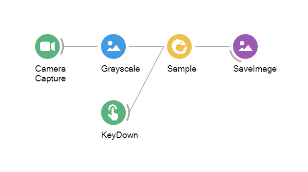
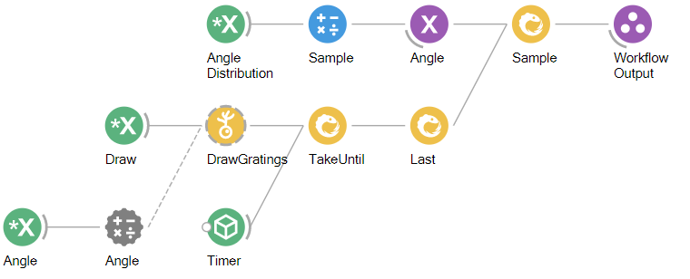

# Bonsai: A Guide for Procedural Programmers

Bonsai is a "visual reactive programming language," which, at its core, is a wrapper around the [ReactiveX](http://reactivex.io/) library with interfaces to many common I/O devices used for neuroscience experiments. ReactiveX is based on concepts from *functional programming*, which may be unfamiliar to those of us who spend the vast majority of our time writing *procedural* code. This can make it difficult to follow the logic behind more complex Bonsai workflows, and can be a major impediment to constructing novel workflows. 

This document will explain how to translate patterns that are prevalent in procedural programming into Bonsai, and to point out cases where a direct translation is not possible or not desirable.

## Procedural versus functional programming

In their ideal form

Procedural programming is:

* Synchronous
* Linear
* State-dependent

Functional programming is:

* Asynchronous
* Non-linear
* Stateless

A procedural program often calls a function within an object that has its own internal state. The output of that function cannot be predicted based on the inputs alone. This is often consistent with our concept of how the world works, which is that our interactions with an object (or a person) depends on that object's internal state.

A functional program (in its ideal form) consists of a series of expressions that always operate on their input values in the same, predictable way. Expressions should have no *side effects*, which change state in some way that cannot be observed by the rest of the program.

## Bonsai example: Video processing

Here is the Bonsai workflow:


And here is Python translation:

```python

from camera_library import DemoCameraObject
from vision_library import (ConvertColor,
                            HsvThreshold,
                            FindContours,
                            BinaryRegionAnalysis,
                            LargestBinaryRegion)
from io_library import CsvWriter

def process_frame(camera, output_file):

    img = camera.getNextFrame()
    img = ConvertColor(img)
    img = HsvThreshold(img)
    contours = FindContours(img)
    components = BinaryRegionAnalysis(contours)
    largest_component = LargestBinaryRegion

    CsvWriter(output_file, largest_component)

camera = DemoCameraObject(0)
output_file = '/path/to/output.csv'

for i in range(1000):

    process_frame(camera, output_file)

```

This doesn't include the visualization, which is much more difficult.

## Twitter metaphor

Tweets cannot be predicted, and must be broadcast to all followers. 



Python translation:

```python
def process_frame(camera, keyboard, output_file):

    img = camera.getNextFrame()
    img = Grayscale(img)

    if keyboard.wasKeyPressed('A'):
        SaveImage(output_file, img)

camera = DemoCameraObject(0)
keyboard = KeyboardInputObject(0)
output_file = '/path/to/output.csv'

for i in range(1000):

    process_frame(camera, keyboard, output_file)

```

Note that the function to check whether or not the key was pressed happens in the same loop as the camera capture. This is an example of synchronous programming, because each function call blocks the next one. While it is possible to do asynchronous programming in Python (typically with the `asyncio` library), this is not often used for our daily programming tasks.

We are starting to see some important differences between the functional model and the procedural model.

## Bonsai operators

Sources - generate event streams from devices or files
Transform - convert or process individual data items
Combinator - manage control flow or synchronize parallel inputs
Sinks - save data or trigger external inputs (the "side effects"); importantly, they do not have any impact on the workflow itself, with data passing through unchanged
Nested - group operators to organize complex processing
Property - organize workflow properties or change their values dynamically

"Subscribe" events
"Termination" events

## `for` statements

One of the most commonly used patterns in procedural programming; allows you to repeat a portion of the code a specified number of times, often with different inputs each time.

However, this doesn't explicitly exist in Bonsai, or functional programming.

Instead of `for`, functional programming uses *higher-order functions* which operate on the functions we're interested in.

In Python, functions are objects that can be passed as inputs to other functions, so this is straightforward to implement.

### Using `map`

This is one way to do it:

```python
inputs = (1,2,3,4)

outputs = map(lambda x : x ** 2, inputs)
```

### Using a higher-order function

This is another way to do it:

Can use a `for` loop internally, but critically there are no side effects! Every state change that happens inside the function is observable from the outside!

```python
inputs = (1,2,3,4)

def repeat(func, inputs): # this not quite the same as Bonsai repeat

    outputs = []
    for i in range(len(inputs)):
        outputs.append(func(inputs[i]))

    return outputs

outputs = repeat(lambda x : x ** 2, inputs)
```

## Time operators

### TimeInterval

Records the time interval between consecutive elements produced by the sequence.

### Timestamp

Records the timestamp for each element produced by the sequence. Creates an output the consists of an input value + a timestamp.


## State machines

Behavioral tasks involve transitions between states. How do we accomplish this using functional programming, if it is "stateless"? In the simplest case, we want to deliver a reward only if a specific condition is met.

Makes a lot of sense to code this with an `if` statement:

```python
if (lickOccurredInWindow):
    deliverReward()
    numRewards += 1
```

Inter-trial interval = Timer "due time"

```python

```

Trial interval = Delay "due time"

Number of trials = Repeat

SelectMany = creates a new state for every new input
- branching structure

Condition - Filter 


CreateRandom -> CreateDistribution -> Sample



```python
import numpy as np

angles = np.random.rand(100) * 2 - 1 # distribution between -1 and 1


```

```python
import random
import glob

def EnumerateFiles(Path, SearchPattern):

    return glob.glob(os.path.join(Path, SearchPattern))

def Variation(InputSequence, Count):

    random.shuffle(InputSequence)

    return InputSequence[:Count]

```

[file1, file2, file3, file4] <-- sequence


Variation