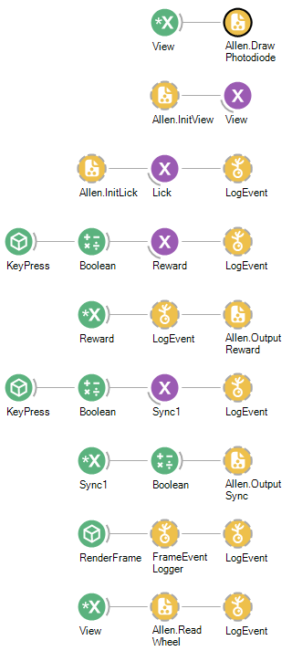
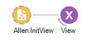
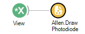
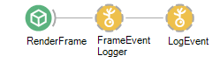
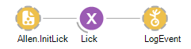
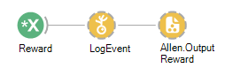
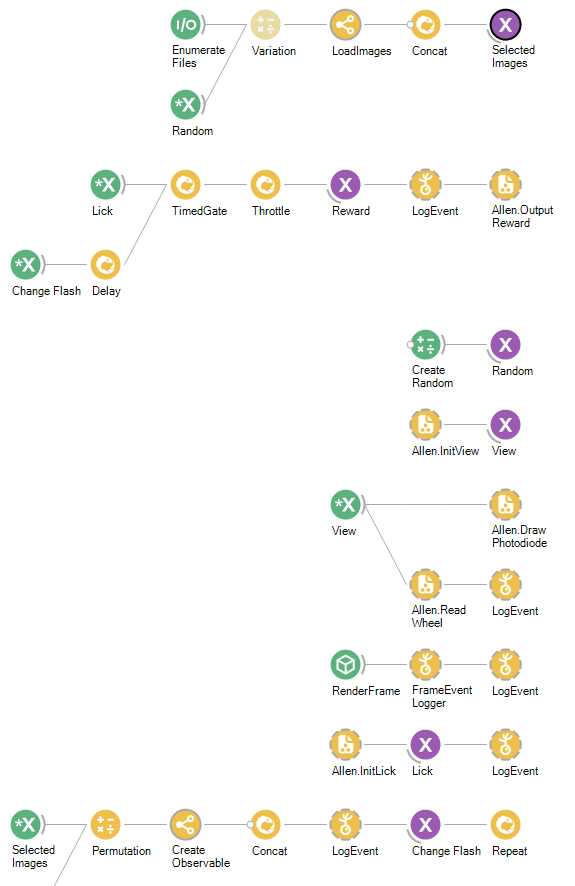

# Allen Institute Bonsai behavior data format standard v1.0

+ 

+

## Introduction 

### Goal of this document

The goal of this document is to describe how to organize file generated by Bonsai to be compatible with Allen Insitute data 
processing pipeline in the context of a behavior pipeline. This document is aimed both at internal engineers, data scientists,
neuro-scientists as well as external contributors and users of the Allen Institute OpenScope project. External teams can 
refer to this document to understand underlying data structure necessary to allow generation of NWB files from Bonsai files. 
We aim to provide sufficients details so that future experiments using the OpenScope pipeline can minimize delays in generating
standardized NWB files. This document is a living document that will be updated as this process is refined to provide the most up-to-date
description of the current standard. 

We describe two sets of files here:
* 'Standardized Bonsai worflow files' are all the files necessary to run a functional bonsai workflow within the Allen Institute 
ecosystem. The Allen Institute pipeline hardware was designed for standardization and reproducibility of operations and deploying new code to this
system necessitates some harmonization of how the worflow and its dependencies are organized. In the context of the OpenScope project, we need to 
communicate these standards to external parties so that new functional worflows can be deployed. In addition, each bonsai workflow needs to respond and 
 communicate with standardized agents and cron jobs running on the Allen Brain Observatory pipeline. We here provide guidance to guarantee these interactions 
 are functional. 

* 'Standardized Bonsai output files' are all the files and data generated by Bonsai to track a behavioral task. Files generated by Bonsai needs to 
follow a set of specifications so that they can be detected, uploaded to our internal storage system, pre-processed and monitored by behavioral 
training agents as well as converted to final NWB files. It is critical for new behavioral tasks to adhere to this standard otherwise the entire
software stack responsible for data processing will have to be updated, which will require the coordination of multiple teams. We aim to mimimize these
efforts by providing detailed specifications up-front. 

### Version history
Small iteration of the standard that maintain backward compatibility should 
be minor releases (ie. v1.X). When backward compatibility is broken, we will make major releases (vX.0).

* v1.0 First draft of the format. 

## Standardized Bonsai worflow files

To support the development of Bonsai worflows compatible with the Allen Institute hardware, we have developed an standardized Bonsai worflow. 
This template is available on our public bonsai repository (LINK TO BE ADDED).
Here is screenshow of this template: 

All Allen internal components are labelled Allen.XXX. Those components will be available through an installable Bonsai package. 
Your behavior should use those components to design its task. The underlying code of those components is visible to you but 
you are expected NOT to modify these to guarantee a fully functional task. You can essentially connect newer objects to them. 
Bonsai's inherent subscription system allows for assembly of complex behaviors using those components without having to worry about 
whether your task will be compatible with the Allen Institute hardware pipeline. 

We describe below a subset of these components. They are also documented within Bonsai. 

* Allen.InitView fully initializes the Allen Institute screen resouces and the associated rig geometry (including warping and gamma 
calibration). The component outputs a view object that we link to a "BehaviorSubject". This view object can be re-used throughout your workflow 
to trigger actions each time a frame is rendered.

* Allen.DrawPhotodiode renders a flickering black and white square on one corner of the screen and is triggered by the previously described
View object. . This is used to monitor the
performance of behavior software and hardware integration throughout the experiment. The square flickers at high speed and 
is used by our data QC system to check for issues. All workflows should have this component. 

* This line sets up the logging system. Bonsai's standardized output file path is set in this component and should not be changed. 
You are expected to use LogEvent to add any behavioral and stimulation information to this file. 

* For behaviors that uses licking information, this is available through the Allen.InitLick component. You should also 
log Licking events to the CSV file as shown here. The Lick object allows you to easily broadcast Licking events throughout your workflow.

* Once your behavior has decided that a reward should be delivered, you can use Allen.OutputReward to send an event to trigger a water 
reward. We also require that this reward is logged through a connected LogEvent. 

You can find an example of a fully functional detection of change task here (ADD LINK TO REPO).
As you can see below, this task is using those standardized components without modifications. 

## Standardized Bonsai output files

### bonsai_event_log.csv
To support the downsteam processing of Bonsai output files, any deployed workflow needs to output a standardized file called 
called 'bonsai_event_log.csv'. This file will store all critical events that a behavior workflow should monitor and record
for analysis purposes. We provide an example of this file below. It contains a list of logged events that occurs during the 
experiments. Each event is encoded as a local json object to facilitate parsing. 
Frames should be logged along with wheel data and all potential parameters used by the workflow. The file is saved 
using Bonsai-BonVision Logging event object so it is easy to add new events to this log. We recommend to trigger saving on the 
rendering View events for regular monitoring as is done for the wheel data. 
To output such event, you just need to use the LogEvent object in Bonsai and enter in the Format field a string like so:
{{"event":"Wheel", "speed":{0} }}
Notice how the curly brackets are doubled except for objects like {0}. {0}, {1}, {2}... objects are replaced with the value of 
selected objects in the LogEvent selector. 

See an example content of this file below: 

Frame,Timestamp,Value 
0,0.0022177,{"event": "Frame"} 
0,0.0022177,{"event":"Wheel", "speed":0.16560677074157} 
1,0.0518899,{"event": "Frame"} 
1,0.0518899,{"event":"Wheel", "speed":0.16560677074157} 
2,0.0674353,{"event": "Frame"} 
2,0.0674353,{"event":"Wheel", "speed":0.524411797767697} 
3,0.0840284,{"event": "Frame"} 
3,0.0840284,{"event":"Wheel", "speed":0.360791510604691} 
4,0.1007981,{"event": "Frame"} 
4,0.1007981,{"event":"Wheel", "speed":0.719596537630817} 
5,0.1175459,{"event": "Frame"} 
5,0.1175459,{"event":"Wheel", "speed":0.555976250467811} 
6,0.1343701,{"event": "Frame"} 
6,0.1343701,{"event":"Wheel", "speed":0.914781277493938} 
7,0.1512397,{"event": "Frame"} 
7,0.1512397,{"event":"Wheel", "speed":0.109966017357058} 
8,0.1681271,{"event": "Frame"} 
8,0.1681271,{"event":"Wheel", "speed":0.468771044383185} 
9,0.1849281,{"event": "Frame"} 
9,0.1849281,{"event":"Wheel", "speed":0.468771044383185} 
10,0.2017817,{"event": "Frame"} 
10,0.2017817,{"event":"Wheel", "speed":0.663955784246305} 
11,0.2185359,{"event": "Frame"} 
11,0.2185359,{"event":"Wheel", "speed":0.0227608112724315} 
12,0.2353679,{"event": "Frame"} 
12,0.2353679,{"event":"Wheel", "speed":0.859140524109425} 
13,0.2521908,{"event": "Frame"} 
13,0.2521908,{"event":"Wheel", "speed":0.859140524109425} 
14,0.2690172,{"event": "Frame"} 
14,0.2690172,{"event":"Wheel", "speed":0.576750578161679} 
15,0.2858793,{"event": "Frame"} 
15,0.2858793,{"event":"Wheel", "speed":0.413130290998672} 
16,0.3026906,{"event": "Frame"} 
16,0.3026906,{"event":"Wheel", "speed":0.771935318024799} 
17,0.3195676,{"event": "Frame"} 
17,0.3195676,{"event":"Wheel", "speed":0.130740345050926} 
18,0.3364116,{"event": "Frame"} 
18,0.3364116,{"event":"Wheel", "speed":0.325925084914046} 
19,0.3532341,{"event": "Frame"} 
19,0.3532341,{"event":"Wheel", "speed":0.325925084914046} 
20,0.3700864,{"event": "Frame"} 
20,0.3700864,{"event":"Wheel", "speed":0.521109824777166} 
21,0.3869002,{"event": "Frame"} 
21,0.3869002,{"event":"Wheel", "speed":0.521109824777166} 
22,0.4036849,{"event": "Frame"} 
22,0.4036849,{"event":"Wheel", "speed":0.716294564640287} 
23,0.4204596,{"event": "Frame"} 

### stimuli/
All external dependencies (images, movies, parameters) used by your workflows should be 
saved under this folder. We will deploy this folder on each individual behavioral computer automatically. 
If possible, we recommend storing those files on the versioned repository along with the worfklow file.

## CSV to SYNC conversion

To be added

## Conversion to NWB files

To be added. 
